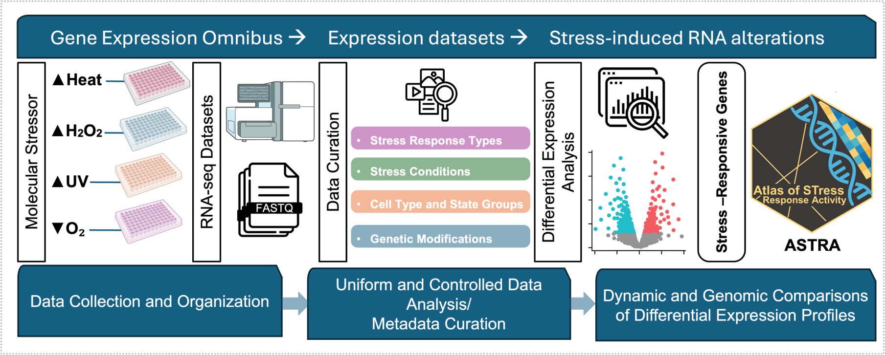

# ASTRA: Atlas of STress Response Activity  

         

**ASTRA** is a curated database for exploring genome-wide RNA expression alterations in human cell lines exposed to molecular stresses.  It integrates transcriptomic datasets across **Heat Shock Stress Response, Oxidative Stress Response, Hypoxia Stress Response, and  DNA Damage Response** conditions to support research in stress biology and transcriptional regulation.  

  

---

## 🚀 Features  

- **Browse Datasets** – explore curated stress-related RNA-seq datasets retrieved from GEO, encompassing diverse experimental designs
- **Gene Search** – query expression across all or selected studies  
- **Differential Expression Analysis** – explore harmonized comparisons with volcano plots & summary statistics  

👉 Try it here: [astra-db.com](https://astra-db.com)  

---

## 📊 Data Overview  

- **669** samples
- **59** RNA-seq studies  
- **46** publications  
- **57** cell types  

---

## 📂 Download  

Curated datasets are available in `.tsv` format:  

- `harmonized_dataset.tsv` – merged study & sample metadata  
- `study_metadata.tsv` – publication-level metadata  
- `sample_metadata.tsv` – individual sample details  
- `gene_annotations.tsv` – gene symbols, Ensembl IDs, biotypes  
- `expression_data.tsv` – TPM expression matrix  
- `differential_expression.tsv` – fold changes & p-values  

---

## 📖 Citation  

If you use **ASTRA** in your research, please cite:  

> *ASTRA: A Comprehensive Resource for Stress-Induced Gene Expression in Human Cell Lines*  

---

